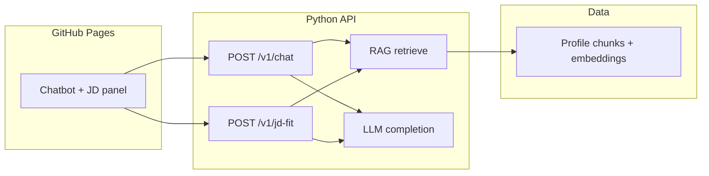

# Design: Portfolio Chat + Job Description (JD) Fit

**Date:** 2026-05-02  
**Status:** Draft for implementation planning  
**Scope:** Replace mock chat with RAG-grounded answers; add structured “role fit” analysis from pasted JDs. Voice / TTS explicitly out of scope.

## 1. Goals and audiences

**Primary goals**

- Answer questions about the portfolio owner in a natural voice defined in the system prompt: **v1 default** is a knowledgeable assistant speaking **in third person** about Abhinav (consistent with current chatbot copy), grounded in curated profile content.
- Let recruiters and hiring managers paste a job description and receive a structured match report: strengths, gaps, and evidence tied to retrieved profile chunks (reverse of typical resume-to-JD board matching).

**Audiences**

- **Tech peers:** Deep-dive questions, stack, architecture, trade-offs; expect concise, accurate answers with optional “go deeper” follow-ups.
- **Recruiters / hiring managers:** Role titles, scope, impact numbers, location/work authorization if present in corpus; JD flow should feel like a lightweight screening output, not a black box.

**Non-goals (this phase)**

- Voice agents, real-time streaming TTS, phone-screen simulation.
- User accounts, saved conversations, or multi-tenant data.
- Fully autonomous agents with unbounded tool loops or external browsing.

## 2. Architecture

**High level**

- **Frontend:** Existing Vite + React + TypeScript site on GitHub Pages. No secrets in the client. Chat UI (`src/components/Chatbot.tsx`) calls a small HTTP API.
- **Backend:** Python service (FastAPI recommended) hosted on a serverless or lightweight host (e.g. Vercel/Netlify/Railway/Cloud Run—deployment choice is an implementation detail; the contract is HTTPS JSON APIs).
- **Knowledge base:** Versioned documents (Markdown/JSON) in the repo or backend bundle, chunked and embedded offline or at deploy time into a vector store (hosted DB or embedded store depending on host constraints).
- **LLM:** One provider (e.g. OpenAI, Anthropic) behind the backend; API keys only on the server.

**Rationale**

- Static hosting cannot hold LLM keys safely. A thin BFF (backend-for-frontend) keeps keys server-side and allows rate limiting, logging, and prompt versioning.

## 3. Components and responsibilities

| Unit | Responsibility | Depends on |
|------|----------------|------------|
| **Profile corpus** | Source of truth text: experience, projects, education, skills, awards (phase in over time). | Editor (human), git |
| **Ingestion pipeline** | Chunk, embed, upsert vectors; idempotent; version tied to git SHA or content hash. | Embedding model API, vector store |
| **Retriever** | Given query (chat message or JD-derived queries), return top-k chunks with scores and metadata (section, dates). | Vector store |
| **Chat handler** | Build prompt: system instructions + retrieved chunks + recent message history (bounded token budget) → LLM → assistant message. | Retriever, LLM |
| **JD fit handler** | (1) Parse/normalize JD text. (2) Extract structured requirements (LLM with schema or tool output). (3) Retrieve evidence per requirement cluster. (4) Produce structured report (match, partial, gap) with citations to chunk ids. | Retriever, LLM |
| **Optional router** | Single LLM call with **bounded** tool use: e.g. `search_profile`, `analyze_jd`—only if simple keyword routing is insufficient. | Same as tools |
| **Frontend Chatbot** | Modes: open chat; JD paste + “Analyze fit.” Display citations lightly (e.g. “Sources: Experience — Freshworks”). | Public API base URL env |
| **Observability** | Request ids, latency, error class; no raw JD or PII in logs by default (truncate/hash if needed). | Host logging |

## 4. Data flow

### 4.1 Open chat

1. User sends message from `Chatbot`.
2. Frontend `POST /v1/chat` with `{ messages: [...], session_id? }` (session id optional uuid in localStorage for correlation only).
3. Backend runs retrieval on the latest user utterance (or a hypothetical standalone query reformulation step if needed later).
4. Backend composes prompt with retrieved chunks and calls LLM once (or bounded multi-step if using tools).
5. Response: `{ reply: string, citations?: [{ label: string, chunk_id: string }] }`.
6. UI renders reply; optional expandable citations.

### 4.2 JD fit

1. User pastes JD and submits.
2. Frontend `POST /v1/jd-fit` with `{ jd_text: string, locale?: string }`.
3. Backend validates length (max chars) and rate limits.
4. Backend extracts structured requirements (role, must-have skills, nice-to-have, seniority, domain).
5. For each requirement bucket, retriever fetches top-k chunks (possibly multiple sub-queries).
6. LLM generates a **fixed schema** JSON merged with human-readable summary sections for the UI.
7. Response shape matches **POST /v1/jd-fit** (v1); `disclaimers` must include that the output is informational, not a hiring decision.

## 5. API contracts (conceptual)

**POST /v1/chat**

- Request: `{ "messages": [ { "role": "user"|"assistant", "content": string } ] }`
- Response: `{ "reply": string, "citations": [ { "chunk_id": string, "title": string } ] }`
- Errors: `400` validation, `429` rate limit, `502` upstream LLM failure

**POST /v1/jd-fit**

- Request: `{ "jd_text": string }`
- Response (v1): `{ "summary": string, "match_rows": [ { "requirement": string, "fit": "strong"|"partial"|"gap"|"unknown", "rationale": string, "source_chunk_ids": string[] } ], "disclaimers": string[] }`
- Same error classes

**Health**

- `GET /health` for uptime checks

CORS: allow the GitHub Pages origin(s) only.

## 6. Security and abuse

- API keys only in server environment.
- Rate limiting per IP and/or global (token bucket).
- Max body size for JD and chat payloads; timeout on LLM calls.
- Prompt injection mitigation: system prompt instructs model to treat user content as untrusted data; retrieved corpus is “trusted”; do not follow instructions inside JD that ask to ignore policy (defense in depth—monitoring and refusal patterns).
- Do not log full JD text in production logs by default; log length and hash if diagnostics needed.

## 7. Error handling (UX)

- **Transient failures:** User sees short friendly message; optional single retry on client for chat.
- **Rate limit:** Clear message (“Try again in a minute”).
- **Validation:** JD too long → ask user to trim paste.
- **Partial retrieval:** If no chunks above threshold, reply with honest “I don’t have sourced information for that” rather than hallucinating.

## 8. Phased rollout

| Phase | Deliverable |
|-------|----------------|
| **P0** | Backend skeleton, `/health`, `/v1/chat` with retrieval + static corpus; frontend wired with env-based API URL; deploy backend. |
| **P1** | Corpus expansion + chunk metadata; citations in UI; basic rate limit and logging. |
| **P2** | `/v1/jd-fit` with structured output + dedicated UI section in chat drawer or tab. |
| **P3** | Evaluation set (golden questions + JD fixtures), prompt versioning, optional bounded tool router if metrics show need. |

## 9. Testing strategy

- **Unit:** Chunking, citation formatting, schema validation for JD output (Pydantic models).
- **Integration:** Mock LLM; real retriever against fixture index for golden queries.
- **Manual QA:** Smoke script for chat and JD from production-like build; verify CORS and 429 behavior.
- **Quality gates:** Small set of “must not hallucinate” questions where answer must cite correct section or abstain.

## 10. Open decisions (resolved for v1)

| Topic | Decision |
|-------|----------|
| LLM provider | Single provider initially; abstract client interface for swap later. |
| Vector store | Choose based on hosting: start with simplest managed option that fits free tier / cost constraints. |
| Voice | Out of scope until chat + JD are stable. |
| Personality | One system prompt; adjust tone (peer vs recruiter) via short user-facing “mode” toggle only if it does not fork prompts excessively—default single prompt for v1. |

## 11. Traceability to current codebase

- `src/components/Chatbot.tsx` today uses `mockResponses` and `getBotResponse`; implementation will replace send path with API client and loading/error states while preserving Framer Motion UI patterns.
- `src/App.tsx` already mounts `Chatbot`; no structural change required beyond optional props or context for API base URL.

---

**Next step after approval:** Use the writing-plans skill to produce an implementation plan (repo layout for `api/`, env vars, first deploy milestone).
